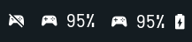

## DualSense Battery

Tiny shell script which displays the battery status of your dualsense controller in polybar.  

Full/Percent/Disconnected



### Dependencies
- `dualsensectl` [AUR](https://aur.archlinux.org/packages/dualsensectl-git) / [GitHub](https://github.com/nowrep/dualsensectl)
- `nerd-font` - for icons. I used Iosevka for screenshots.

### Configuration
Place the .sh file anywhere you want and put the location in 'exec' field.  
Don't forget the & at the end.


### Module
```ini
[module/dualsense-battery]
type = custom/script
exec = ~/dualsense-battery.sh &
tail = false
interval = 60
```
